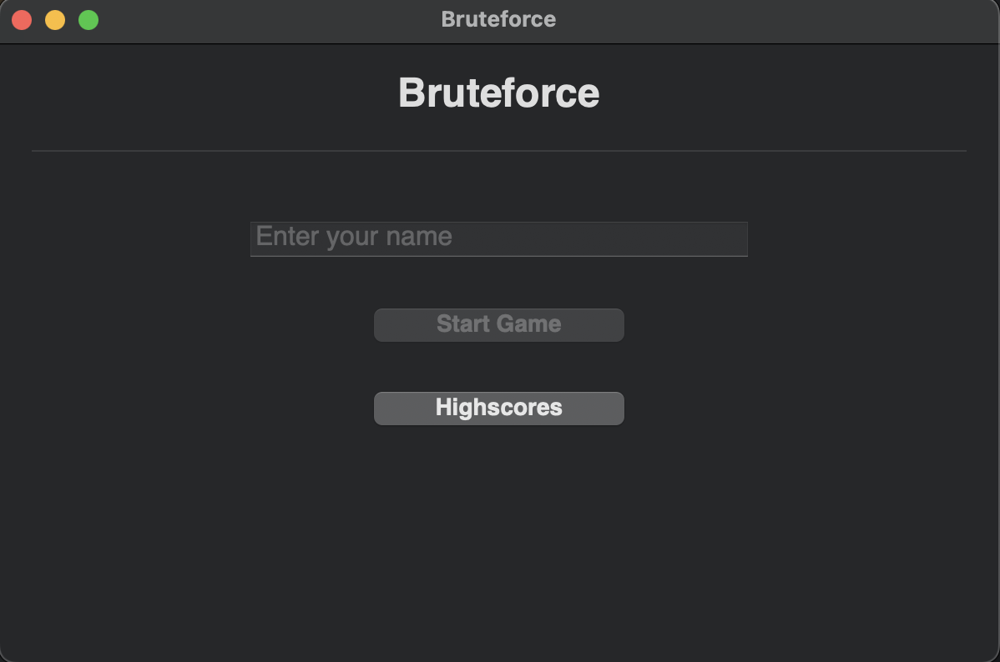
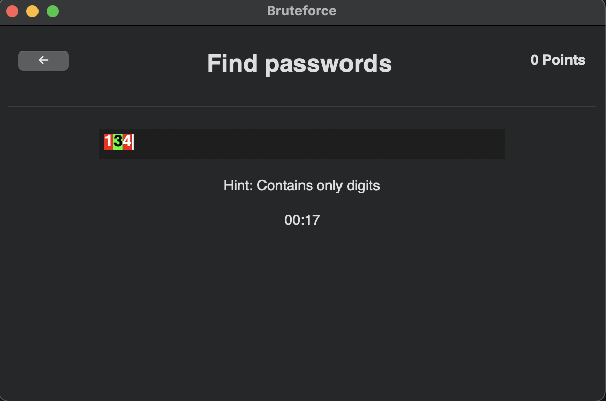
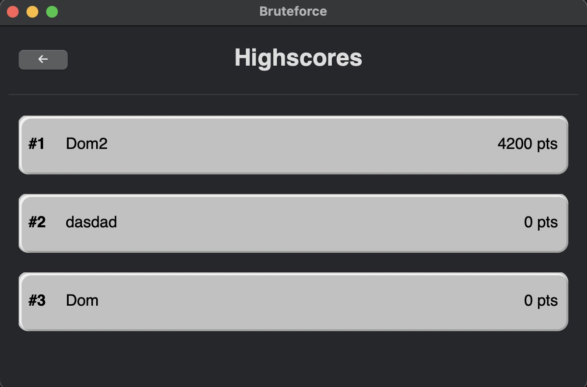

# bruteforce

This is the final project for the course [700.016 (24W) Advanced Programming in C/C++] at Alpen-Adria University Klagenfurt.

The basic inspiration is coming from [this](https://www.reddit.com/r/badUIbattles/comments/1fzgm6f/manual_bruteforce/?utm_source=share&utm_medium=web3x&utm_name=web3xcss&utm_term=1&utm_content=share_button)
reddit post. 

## Setup

Install [Conan](https://docs.conan.io/2/installation.html).

When using CLion, install the [Conan plugin](https://www.jetbrains.com/help/clion/conan-plugin.html).

## Application

The application is built with C++ using [wxWdigets](https://www.wxwidgets.org/) and represents a game with the following features.

### Main screen

The main screen provides input for the user's name, navigation to the actual game, and navigation to an overview of the high scores.

### Game screen

The objective of the game is for the user to "guess" the correct password within a time limit.

- If the time runs out, the game is over.
- If the password is guessed correctly, a new password is generated, and the user earns points based on the remaining time and the password's difficulty.

As the user successfully enters more passwords, the difficulty increases. A hint provides some guidance regarding the character set used in the password. For simple levels, this includes only digits. Later levels become more challenging, incorporating special characters, lowercase letters, uppercase letters, and mixed variations.

The actual implementation can be found in [PasswordGenerator.cpp](PasswordGenerator.cpp).

### Highscore screen

The top 10 scores are saved and displayed on the high score screen.

